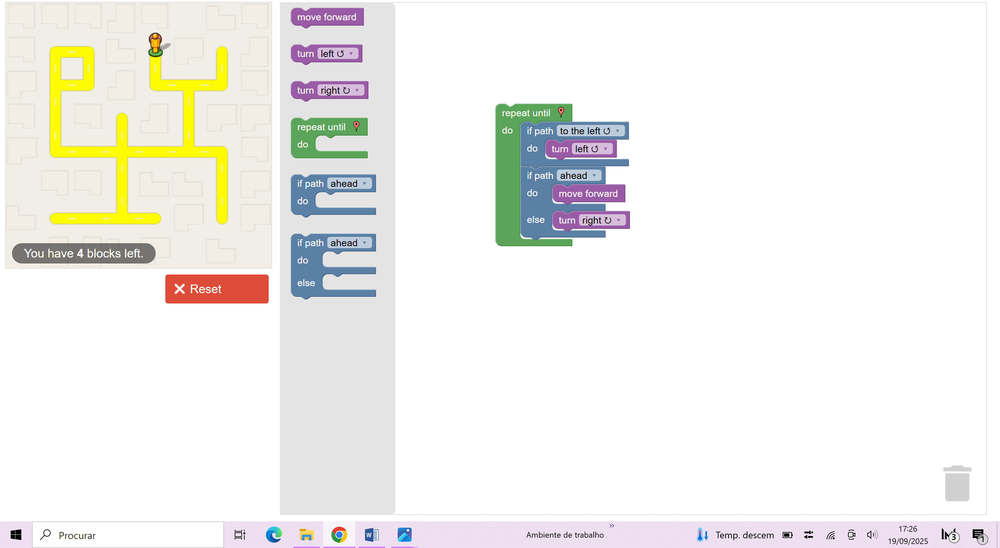
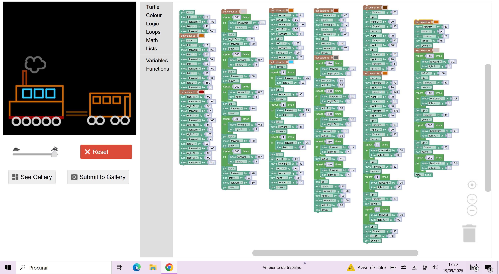

# TPC1: Blockly Games

## Autor

- Daniela Teixeira Faria
- a107228

## Resumo

A TP1 consistiu na realização de vários exercícios do Blockly Games.
O TPC consistiu:
* Resolução do exercício 10 do Maze;
* Desenhar no turtle a figura que o professor fez no quadro

## Resultados

* Imagem com o programa do maze 10: 
* Imagem no turtle: 
